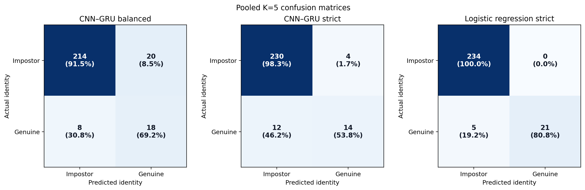
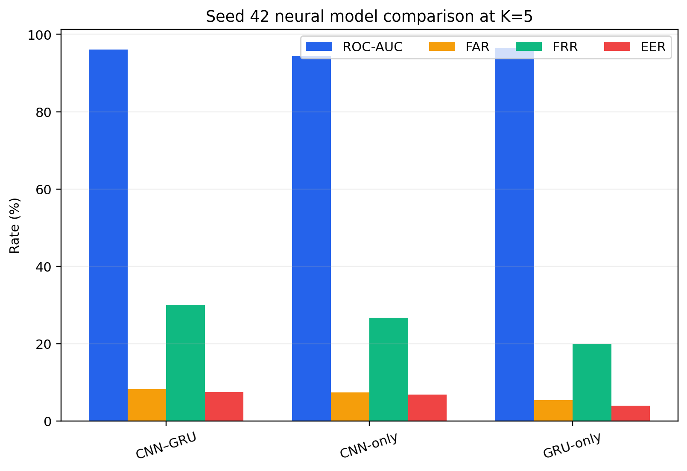
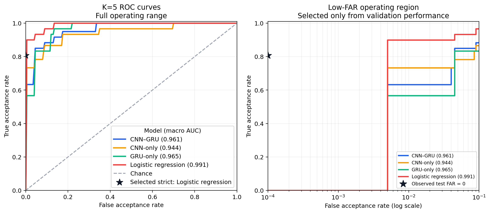
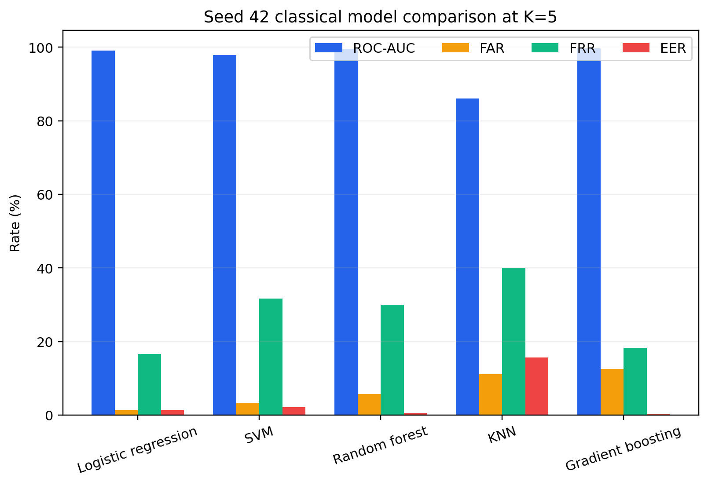
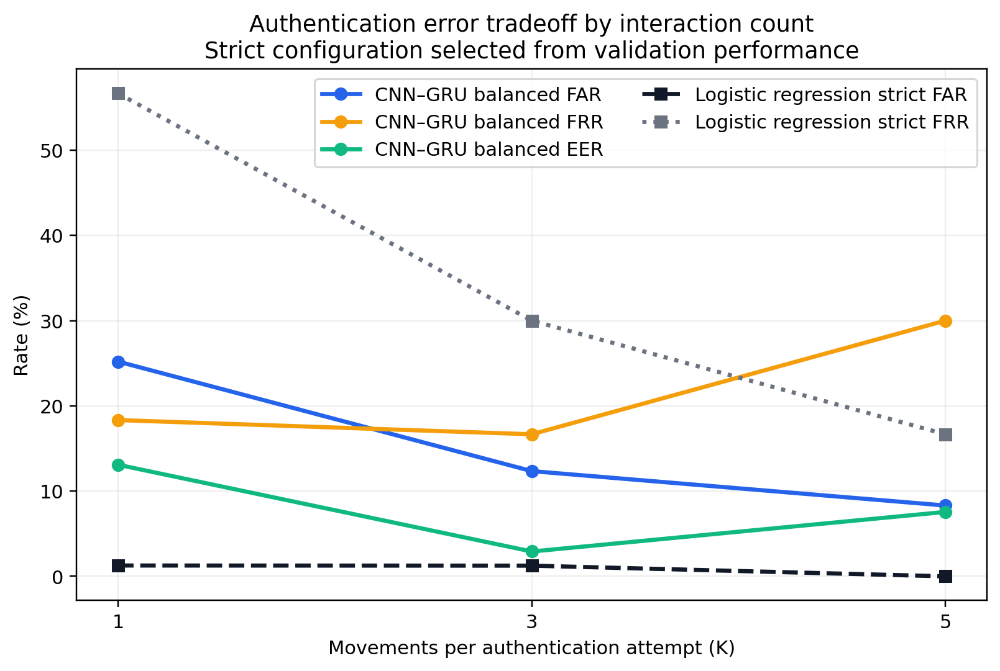
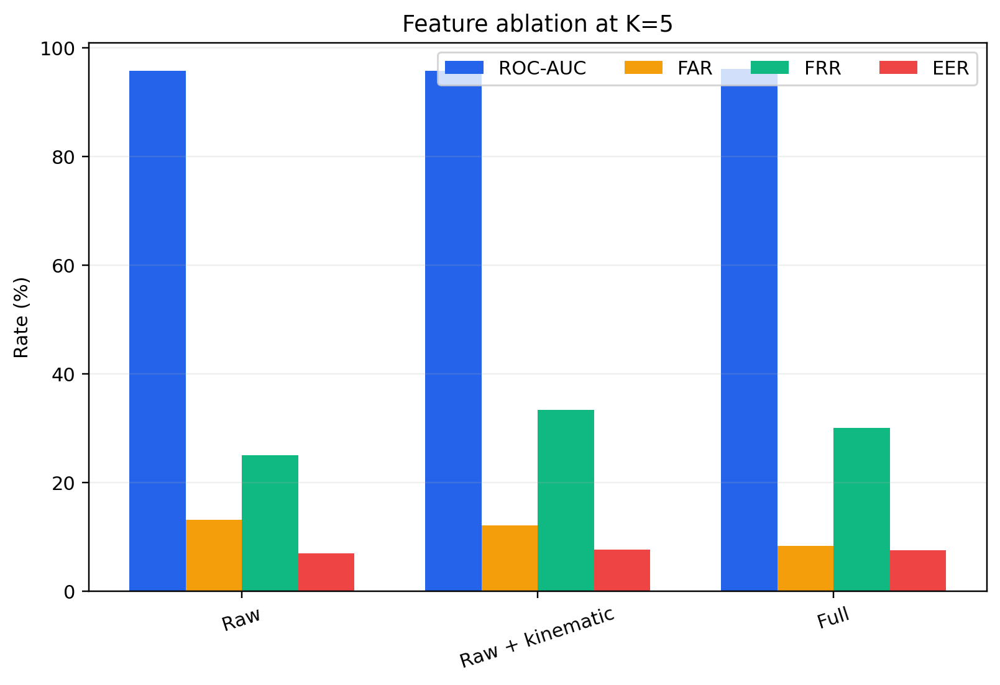
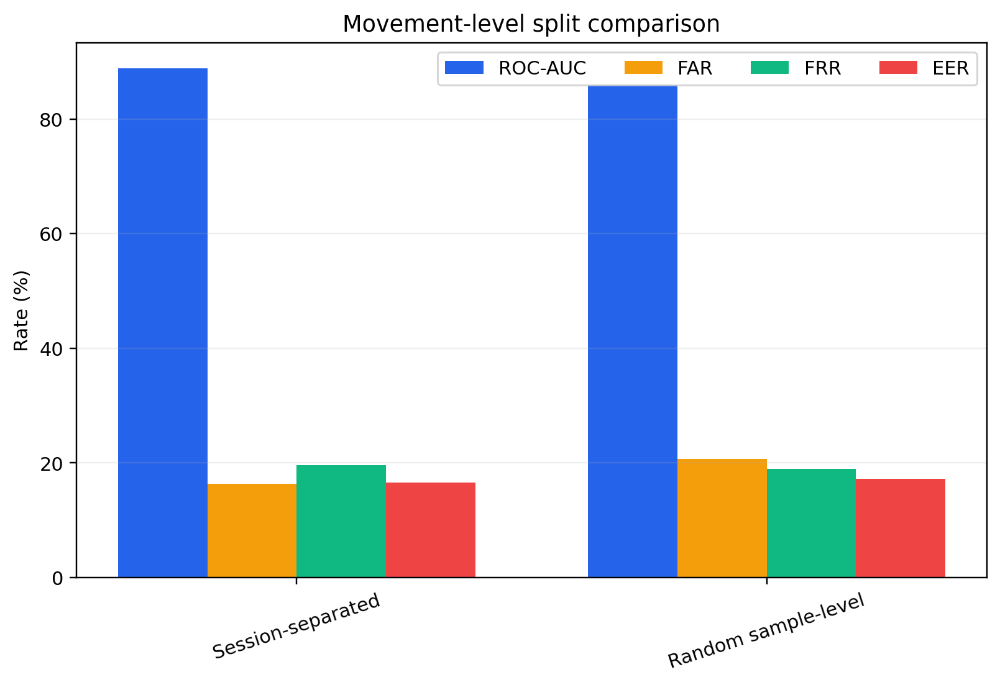
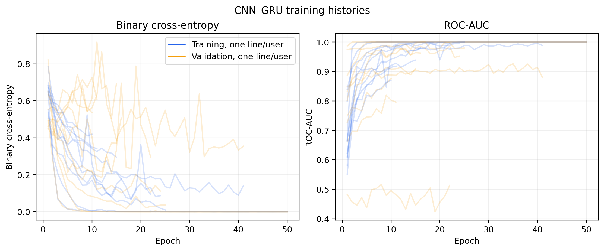

# NeuroCursor complete real-data evaluation

## Result

Validation-only model selection identified **Logistic regression with full features** as the best strict security configuration. It minimized validation FRR among models with zero empirical validation false accepts. No false acceptances were observed in this held-out sample. Its held-out K=5 macro FAR was **0.0000%**, pooled FAR was **0.0000%**, macro FRR was **16.67%**, and accuracy was **98.08%**.

The zero observed FAR is a finite-sample result, not a population guarantee. With 234 held-out impostor decisions, the one-sided exact 95% FAR upper bound is **1.2721%**.

The paper's proposed CNN–GRU remains reported at its balanced operating point: **96.13% macro ROC-AUC**, **89.23% accuracy**, **8.31% FAR**, **30.00% FRR**, and **7.56% EER** at K=5.

## Data and protocol

- Anonymized users: **10**
- Sessions / attempts: **266 / 266**
- Point-and-click movements: **1330**
- Primary split: **session-separated**
- Threshold selection: validation data only; test labels never select thresholds
- Strict model selection: lowest validation FRR among configurations with zero empirical validation FAR
- Reported table values: macro-average across one-vs-rest user verifiers
- Tables IV–VI use K=5 attempt-level decisions; Table V separately varies K
- Table VII uses movement-level metrics because random sample splitting does not preserve complete attempts
- Random seed: **42**
- Permutation tests / bootstrap intervals: **10,000 / 1,000 per user and K**

## Paper completion checklist

| Paper requirement | Completed output |
| --- | --- |
| CNN–GRU, CNN-only, GRU-only | Table IV, ROC figure, comparison figure |
| Logistic regression, SVM, random forest, KNN, gradient boosting | Classical table and figure |
| K=1, 3, 5 | Table V and tradeoff figure |
| Raw, raw + kinematic, full features | Table VI and ablation figure |
| Session-separated vs random sample split | Table VII and split figure |
| Accuracy, precision, recall, F1, ROC-AUC, FAR, FRR, EER | Tables IV and classical baseline table |
| One-sided permutation test, Cohen's d, bootstrap 95% CIs | Per-user statistical table |
| Confusion matrix | Pooled K=5 balanced and security matrices |
| Training behavior | Per-user training and validation history figure |

## Validation selection improves the strict security result

| Configuration | Selection | Accuracy | Precision | Recall | F1 | ROC-AUC | FAR | FRR | EER | TN | FP | FN | TP |
| --- | --- | --- | --- | --- | --- | --- | --- | --- | --- | --- | --- | --- | --- |
| CNN–GRU balanced | Paper operating point | 89.23% | 69.33% | 70.00% | 60.46% | 96.13% | 8.31% | 30.00% | 7.56% | 214 | 20 | 8 | 18 |
| CNN–GRU strict | Zero empirical validation FAR | 93.85% | 72.50% | 48.33% | 55.24% | 96.13% | 1.69% | 51.67% | 7.56% | 230 | 4 | 12 | 14 |
| Logistic regression strict | Lowest validation FRR among zero-validation-FAR models | 98.08% | 100.00% | 83.33% | 90.00% | 99.13% | 0.00% | 16.67% | 1.30% | 234 | 0 | 5 | 21 |

### Selection and held-out evidence

| Selected configuration | Validation macro FAR | Validation macro FRR | Held-out impostor trials | Held-out false accepts | Observed pooled FAR | Held-out macro FAR | Held-out macro FRR | One-sided 95% FAR upper bound |
| --- | --- | --- | --- | --- | --- | --- | --- | --- |
| Logistic regression | 0.0000% | 2.00% | 234 | 0 | 0.0000% | 0.0000% | 16.67% | 1.2721% |



The confusion matrices show why model selection matters: the validation-selected Logistic regression strict configuration eliminated the held-out false accepts seen in the strict CNN–GRU configuration while rejecting fewer genuine attempts. Percentages inside cells are normalized by actual class. Macro rates average user-specific rates, so they can differ slightly from rates recomputed from pooled counts.

## Table IV — neural model comparison

| Configuration | Accuracy | Precision | Recall | F1 | ROC-AUC | FAR | FRR | EER |
| --- | --- | --- | --- | --- | --- | --- | --- | --- |
| CNN–GRU | 89.23% | 69.33% | 70.00% | 60.46% | 96.13% | 8.31% | 30.00% | 7.56% |
| CNN-only | 91.15% | 66.77% | 73.33% | 65.24% | 94.45% | 7.34% | 26.67% | 6.79% |
| GRU-only | 93.08% | 67.11% | 80.00% | 68.64% | 96.48% | 5.37% | 20.00% | 4.01% |





An ROC curve is threshold-independent. The low-FAR panel marks the strict Logistic regression operating point selected without test metrics. A zero observed FAR is placed at the panel's positive log-scale floor; it should be read together with the finite-sample upper bound above.

## Classical baselines

| Configuration | Accuracy | Precision | Recall | F1 | ROC-AUC | FAR | FRR | EER |
| --- | --- | --- | --- | --- | --- | --- | --- | --- |
| Logistic regression | 96.92% | 95.00% | 83.33% | 86.67% | 99.13% | 1.30% | 16.67% | 1.30% |
| SVM | 93.46% | 81.50% | 68.33% | 65.81% | 97.90% | 3.37% | 31.67% | 2.14% |
| Random forest | 91.15% | 85.19% | 70.00% | 66.67% | 99.57% | 5.74% | 30.00% | 0.65% |
| KNN | 86.54% | 42.82% | 60.00% | 47.40% | 86.05% | 11.18% | 40.00% | 15.64% |
| Gradient boosting | 86.15% | 81.63% | 81.67% | 72.43% | 99.66% | 12.61% | 18.33% | 0.42% |



## Table V — number of interactions

| K | FAR | FRR | EER | ROC-AUC | Duration (s) |
| --- | --- | --- | --- | --- | --- |
| 1 | 25.19% | 18.33% | 13.09% | 90.91% | 1.05 |
| 3 | 12.34% | 16.67% | 2.91% | 95.61% | 2.79 |
| 5 | 8.31% | 30.00% | 7.56% | 96.13% | 4.56 |



This figure compares the paper's balanced CNN–GRU error rates with the validation-selected strict Logistic regression configuration at K=1, 3, and 5.

## Table VI — feature ablation

| Feature set | ROC-AUC | FAR | EER |
| --- | --- | --- | --- |
| Raw | 95.77% | 13.11% | 7.00% |
| Raw + kinematic | 95.72% | 12.07% | 7.64% |
| Full | 96.13% | 8.31% | 7.56% |



## Table VII — split comparison

| Split | ROC-AUC | FAR | EER |
| --- | --- | --- | --- |
| Session-separated | 88.90% | 16.33% | 16.56% |
| Random sample-level | 85.96% | 20.71% | 17.19% |



The random sample-level split is included only as the paper's secondary sensitivity analysis. It can mix movements from the same session across partitions and must not replace the session-separated primary estimate.

## Statistical analysis at K=5

| User | Permutation p | Cohen d | AUC 95% CI | FAR 95% CI | FRR 95% CI |
| --- | --- | --- | --- | --- | --- |
| user_001 | 0.00040 | not estimable | 100.00%–100.00% | 0.00%–0.00% | 0.00%–100.00% |
| user_002 | 0.00780 | 1.549 | 73.91%–100.00% | 0.00%–13.04% | 0.00%–100.00% |
| user_003 | 0.07429 | 1.058 | 54.17%–100.00% | 8.33%–41.67% | 0.00%–100.00% |
| user_004 | 0.00300 | not estimable | 100.00%–100.00% | 0.00%–0.00% | 0.00%–100.00% |
| user_005 | 0.00020 | 6.130 | 100.00%–100.00% | 0.00%–0.00% | 0.00%–0.00% |
| user_006 | 0.00270 | 1.626 | 85.51%–100.00% | 4.35%–34.78% | 0.00%–0.00% |
| user_007 | 0.00100 | 4.979 | 100.00%–100.00% | 0.00%–13.04% | 0.00%–0.00% |
| user_008 | 0.00050 | 3.570 | 91.30%–100.00% | 0.00%–0.00% | 0.00%–100.00% |
| user_009 | 0.07829 | not estimable | 88.00%–100.00% | 16.00%–52.00% | 0.00%–0.00% |
| user_010 | 0.00090 | 8.687 | 100.00%–100.00% | 0.00%–0.00% | 0.00%–100.00% |

The one-sided alternative is that genuine scores exceed impostor scores. Bootstrap intervals are stratified by class. These tests are run per claimed identity because the system trains one verifier per identity. Cohen's d is marked “not estimable” when a class has fewer than two attempts or the pooled within-class variance is effectively zero.

## Training diagnostics



## Limitations

- This is a single deterministic split of a modest ten-user dataset, not an independent external validation cohort.
- One participant has only three eligible sessions, which makes that verifier's held-out estimates especially discrete and uncertain.
- Macro metrics weight each claimed identity equally; pooled confusion counts weight individual decisions.
- A lower FAR is not free: a stricter threshold generally raises FRR. Both are shown so the security gain is not presented without its usability cost.
- Zero false accepts in 234 held-out impostor decisions has a one-sided 95% FAR upper bound of 1.2721%; substantially more independent impostor trials are required to characterize rare-event performance.
- Selecting among several model families can make this result optimistic despite using validation metrics only. A new untouched external cohort is required for confirmatory evaluation.
- The paper's blank result tables are now filled from this dataset; these measurements should replace placeholders only if this is the intended study cohort.
- Classical baselines use documented temporal summary features. The paper names the baselines but does not specify every hyperparameter, so the exact reproducible choices remain in `model/model.py`.

## Reproduce

From the repository root, using an environment with `tensorflow==2.16.2`, `scikit-learn==1.6.1`, `scipy==1.15.1`, `matplotlib==3.10.0`, and `joblib==1.4.2`:

```bash
python -m pip install -r model/requirements-results.txt

python model/model.py experiment \
  --data /path/to/paper-dataset.json \
  --output-dir artifacts/paper-experiment \
  --target-far 0 \
  --seed 42 \
  --permutations 10000 \
  --bootstrap-samples 1000

python model/reporting.py \
  --experiment-dir artifacts/paper-experiment \
  --output-dir results/paper-real-data
```

Raw participant data, trained weights, and per-attempt scores are intentionally excluded from Git. The committed report contains anonymized aggregate results, paper tables, figures, and checksums.
