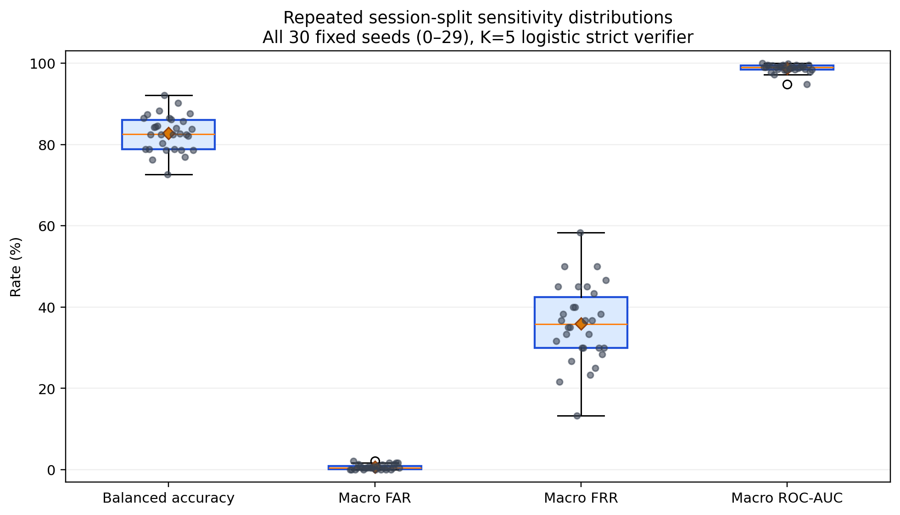
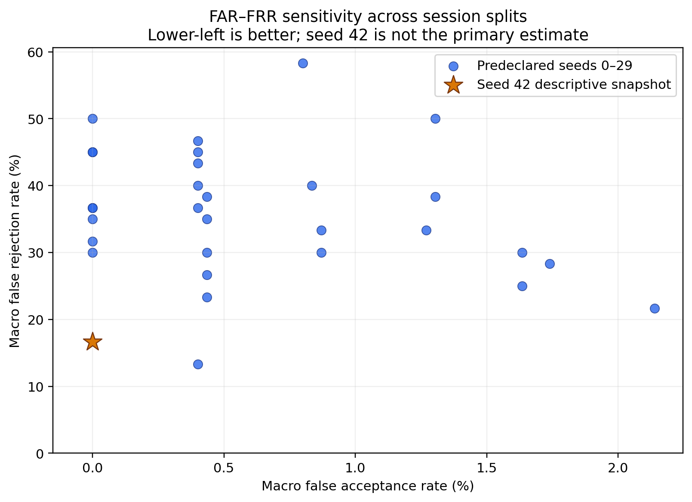
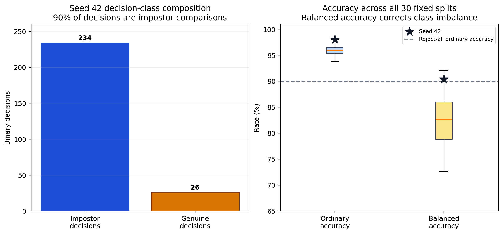
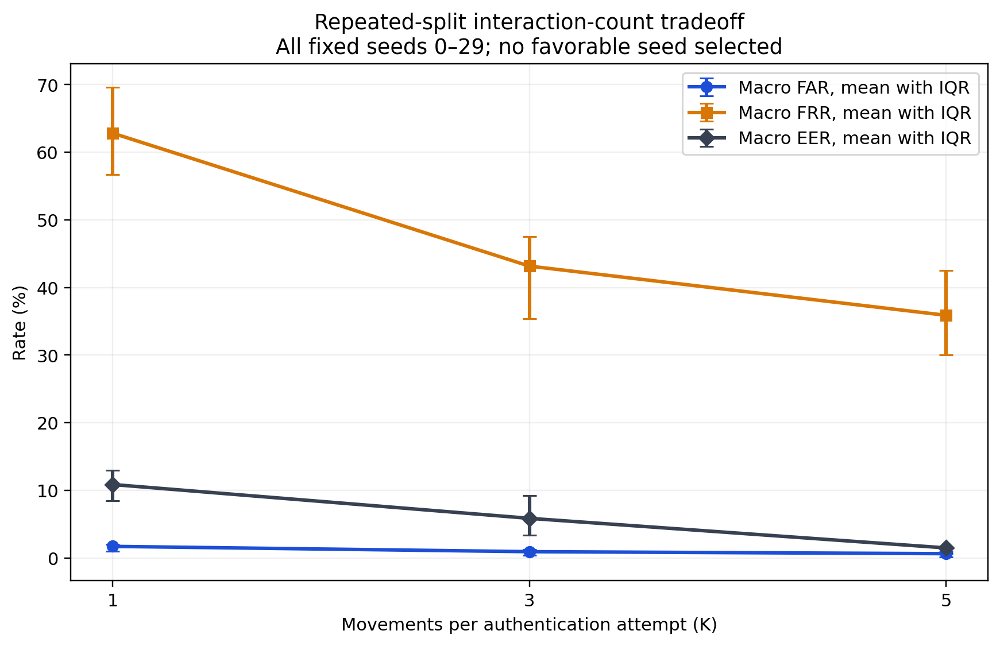
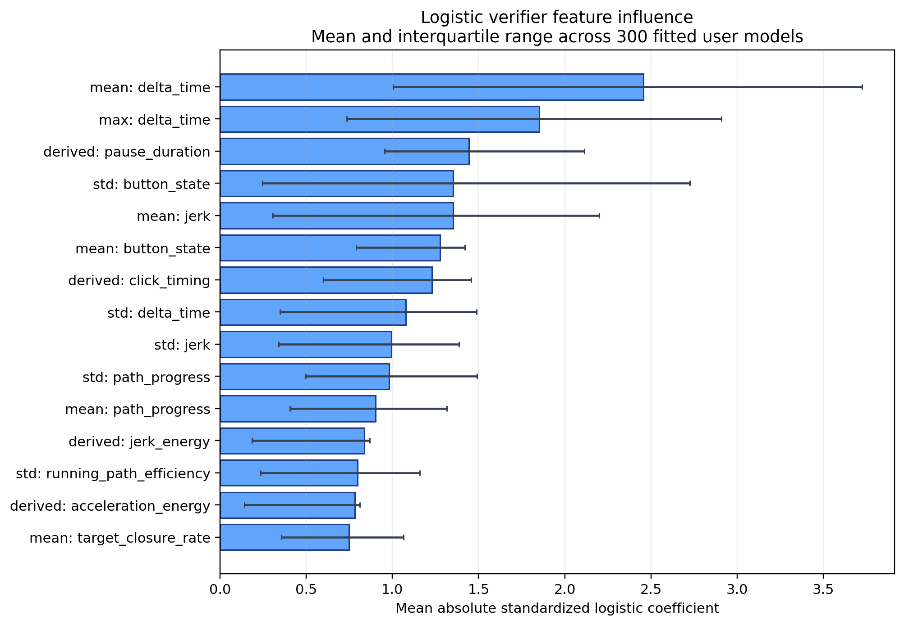
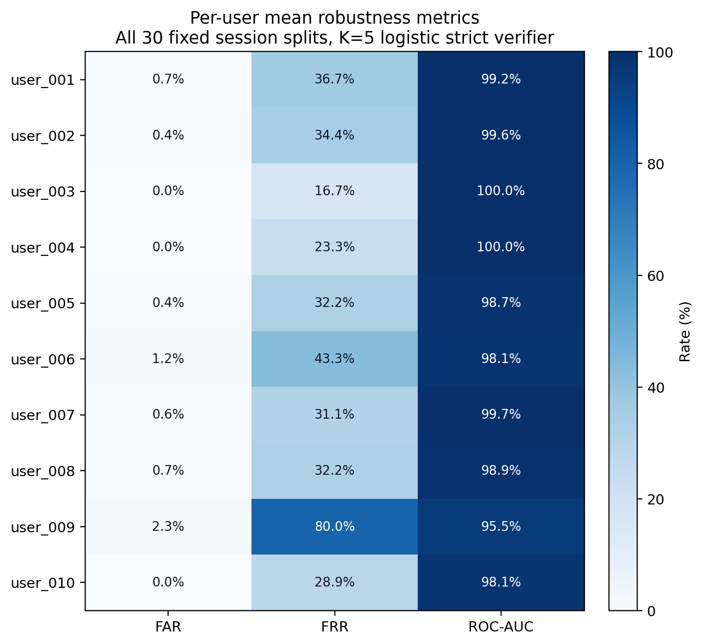
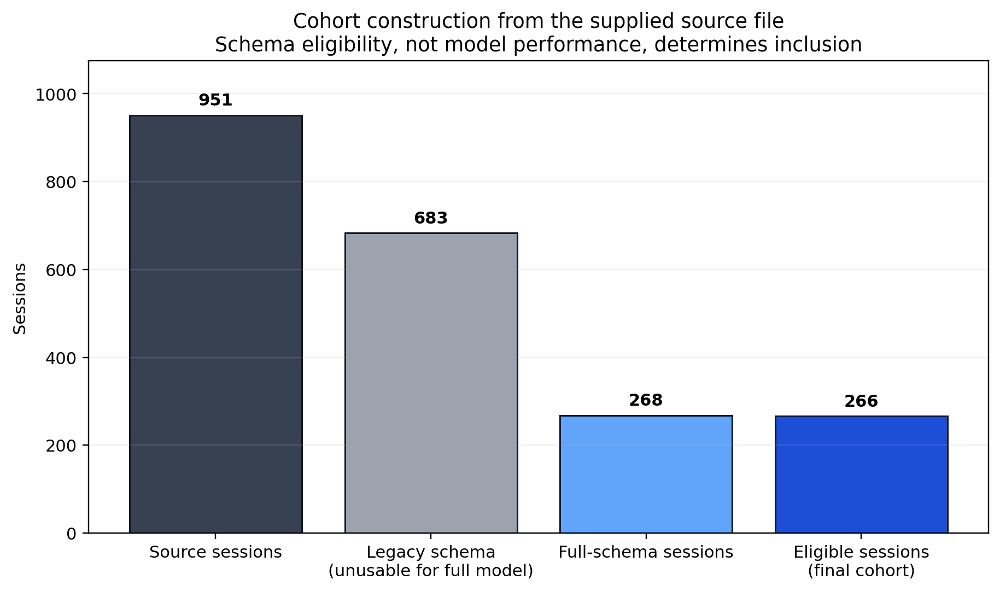

# NeuroCursor complete and honest real-data evaluation

## Technical summary

The most defensible result is the **30-split sensitivity distribution**, not the best single split. With a fixed full-feature logistic verifier configuration, K=5, per-user thresholds calibrated for zero empirical validation false accepts, and every seed in the fixed consecutive grid 0–29 reported, mean pooled balanced accuracy was **82.82%**, mean macro FAR was **0.63%**, mean macro FRR was **35.89%**, and mean macro ROC-AUC was **98.78%**. Only **8 of 30** splits observed zero false accepts. The model is refit within each split. This grid was fixed for the sensitivity analysis but was not externally preregistered.

The prior seed-42 logistic result is real and reproducible—TN=234, FP=0, FN=5, TP=21—but it is now labeled a **post-hoc descriptive snapshot**. Its ordinary accuracy of **98.08%** is aided by the fact that **90.00%** of its binary decisions are impostor comparisons; a reject-all classifier would already score **90.00%** ordinary accuracy. Its pooled balanced accuracy is **90.38%**.

The paper's expected superiority claims are not forced onto the evidence. The proposed CNN–GRU does not outperform the tested GRU-only or strongest classical baselines, the interaction-count and feature-ablation results are mixed, and the random sample-level split is not better than the session-separated split on this dataset.

## Repeated splits replace a favorable snapshot as the primary result

| Metric | Mean | Median | IQR | Minimum | Maximum |
| --- | --- | --- | --- | --- | --- |
| Ordinary accuracy | 96.05% | 95.96% | 95.38%–96.54% | 93.85% | 98.08% |
| Balanced accuracy | 82.82% | 82.59% | 78.85%–86.00% | 72.65% | 92.09% |
| Macro FAR | 0.63% | 0.43% | 0.10%–0.87% | 0.00% | 2.14% |
| Macro FRR | 35.89% | 35.83% | 30.00%–42.50% | 13.33% | 58.33% |
| Macro ROC-AUC | 98.78% | 99.02% | 98.48%–99.39% | 94.78% | 100.00% |
| Macro EER | 1.49% | 0.86% | 0.63%–1.70% | 0.00% | 5.49% |
| Average K=5 duration (s) | 4.43 | 4.45 | 4.27–4.49 | 4.07 | 4.86 |



The boxplots and individual points show every split in the fixed grid. They quantify both the typical result and the spread that a single seed hides. These are repeated holdout sensitivity estimates using overlapping source data, not 30 independent external cohorts.



The seed-42 point is shown only for traceability. It is favorable on FRR relative to most repeated splits and therefore is not used as the primary performance estimate.

## Ordinary accuracy overstates performance under the 9:1 decision imbalance



Each of the 26 seed-42 test sessions is evaluated once against its genuine verifier and nine times against impostor verifiers, creating 26 genuine and 234 impostor decisions. Balanced accuracy, FAR, and FRR are therefore more informative than ordinary accuracy.

| Metric | Definition | Use |
| --- | --- | --- |
| Ordinary accuracy | (TP + TN) / all decisions | Reported for paper compatibility; inflated by 9:1 impostor/genuine decision composition. |
| Balanced accuracy | (true-accept rate + true-reject rate) / 2 | Primary accuracy context for imbalanced verification decisions. |
| FAR | FP / (FP + TN) | Unauthorized acceptance rate; macro values average user verifiers. |
| FRR | FN / (FN + TP) | Legitimate-user rejection rate; report macro and pooled values separately. |
| EER | Approximate point where FAR equals FRR | Threshold-independent score-separation summary derived from ROC points. |
| ROC-AUC | Area under true-accept versus false-accept curve | Ranking quality across thresholds; does not guarantee a deployable FAR. |
| Macro average | Equal average across ten user-specific verifiers | Prevents high-volume users from dominating a metric. |
| Pooled rate | Rate recomputed from summed confusion counts | Represents the decision-weighted aggregate; may differ from macro rates. |

## The seed-42 confusion matrices are descriptive, not confirmatory

| Configuration | Status | Ordinary accuracy | Balanced accuracy | Macro FAR | Macro FRR | ROC-AUC | TN | FP | FN | TP |
| --- | --- | --- | --- | --- | --- | --- | --- | --- | --- | --- |
| CNN–GRU balanced | Paper validation-EER threshold | 89.23% | 80.34% | 8.31% | 30.00% | 96.13% | 214 | 20 | 8 | 18 |
| CNN–GRU strict | Zero empirical validation false accepts | 93.85% | 76.07% | 1.69% | 51.67% | 96.13% | 230 | 4 | 12 | 14 |
| Logistic regression strict | Post-hoc descriptive seed-42 snapshot | 98.08% | 90.38% | 0.00% | 16.67% | 99.13% | 234 | 0 | 5 | 21 |


The logistic strict snapshot observed zero false accepts in 234 impostor decisions and five false rejects in 26 genuine decisions. That zero is not a population guarantee: its one-sided exact 95% FAR upper bound is **1.2721%**. The test results of multiple configurations had already been inspected before this configuration was highlighted, so this split cannot serve as an untouched final confirmation.

| User | Validation FAR | Validation FRR | Test FAR | Test FRR | ROC-AUC | TN | FP | FN | TP |
| --- | --- | --- | --- | --- | --- | --- | --- | --- | --- |
| user_001 | 0.00% | 0.00% | 0.00% | 33.33% | 100.00% | 23 | 0 | 1 | 2 |
| user_002 | 0.00% | 0.00% | 0.00% | 0.00% | 100.00% | 23 | 0 | 0 | 3 |
| user_003 | 0.00% | 0.00% | 0.00% | 0.00% | 100.00% | 24 | 0 | 0 | 2 |
| user_004 | 0.00% | 0.00% | 0.00% | 0.00% | 100.00% | 24 | 0 | 0 | 2 |
| user_005 | 0.00% | 20.00% | 0.00% | 0.00% | 100.00% | 23 | 0 | 0 | 3 |
| user_006 | 0.00% | 0.00% | 0.00% | 33.33% | 98.55% | 23 | 0 | 1 | 2 |
| user_007 | 0.00% | 0.00% | 0.00% | 33.33% | 100.00% | 23 | 0 | 1 | 2 |
| user_008 | 0.00% | 0.00% | 0.00% | 33.33% | 97.10% | 23 | 0 | 1 | 2 |
| user_009 | 0.00% | 0.00% | 0.00% | 0.00% | 100.00% | 25 | 0 | 0 | 1 |
| user_010 | 0.00% | 0.00% | 0.00% | 33.33% | 95.65% | 23 | 0 | 1 | 2 |

## The paper's research questions yield negative and mixed findings

| Research question | Answer | Evidence |
| --- | --- | --- |
| RQ1: Does CNN–GRU outperform the baselines? | No | GRU-only and multiple classical models outperform CNN–GRU on key reported metrics. |
| RQ2: How does K change performance? | Non-monotonic tradeoff | More movements reduce FAR overall, but K=3 has lower CNN–GRU EER and K=5 has higher FRR. |
| RQ3: Which features contribute? | Timing and click dynamics dominate logistic coefficients | Mean/max delta time, pause duration, button-state variation, jerk, and click timing rank highest. |
| RQ4: How does threshold affect errors? | Stricter thresholds reduce FAR by increasing FRR | The ROC, confusion matrices, and strict-versus-balanced table show the tradeoff directly. |
| RQ5: Is performance stable across sessions? | No; material split sensitivity remains | Across 30 splits, K=5 FAR ranges 0.00%–2.14% and FRR ranges 13.33%–58.33%. |
| RQ6: Hardware/target/sampling sensitivity? | Not established | Hardware and device labels are absent; timing-heavy coefficients make acquisition confounding plausible. |

| Hypothesis | Outcome | Evidence |
| --- | --- | --- |
| H1: CNN–GRU has lower EER than CNN-only and GRU-only | Rejected | CNN–GRU 7.56%; CNN-only 6.79%; GRU-only 4.01% EER. |
| H2: K=5 improves over K=1 | Partially supported | CNN–GRU FAR/EER improve from 25.19%/13.09% at K=1 to 8.31%/7.56% at K=5, but K=3 has the lowest EER (2.91%) and K=5 FRR rises to 30.00%. |
| H3: Derived features outperform raw coordinates | Mixed | Full features improve AUC (96.13% vs 95.77%) and FAR (8.31% vs 13.11%), but raw has slightly lower EER (7.00% vs 7.56%). |
| H4: Session separation performs worse than random samples | Rejected on this dataset | Session-separated movement AUC/FAR/EER are 88.90%/16.33%/16.56% versus 85.96%/20.71%/17.19% for random sample splitting. |

These outcomes answer the paper's questions without selecting only favorable comparisons. Hardware, device, replay, and imitation sensitivity remain unmeasured because the supplied data do not contain the required labels or attack trials.

## More movements change the tradeoff but do not improve every metric monotonically

### Paper Table V: seed-42 CNN–GRU snapshot

| K | FAR | FRR | EER | ROC-AUC | Duration (s) |
| --- | --- | --- | --- | --- | --- |
| 1 | 25.19% | 18.33% | 13.09% | 90.91% | 1.05 |
| 3 | 12.34% | 16.67% | 2.91% | 95.61% | 2.79 |
| 5 | 8.31% | 30.00% | 7.56% | 96.13% | 4.56 |


The seed-42 CNN–GRU result improves FAR from K=1 to K=5, but K=3 has the lowest EER and K=5 has the highest FRR. The paper's claim is therefore only partially supported.

### Repeated-split strict logistic sensitivity

| K | Mean FAR | FAR IQR | Mean FRR | FRR IQR | Mean EER | Mean balanced accuracy | Mean duration (s) | Zero-FP splits |
| --- | --- | --- | --- | --- | --- | --- | --- | --- |
| 1 | 1.71% | 0.97%–2.04% | 62.83% | 56.67%–69.58% | 10.86% | 67.22% | 0.98 | 1/30 |
| 3 | 0.93% | 0.43%–1.27% | 43.17% | 35.42%–47.50% | 5.86% | 78.95% | 2.74 | 3/30 |
| 5 | 0.63% | 0.10%–0.87% | 35.89% | 30.00%–42.50% | 1.49% | 82.82% | 4.43 | 8/30 |



The repeated-split view reports means and interquartile ranges across every seed in the fixed grid. It is the more reliable description of how K changes strict-verifier behavior in this dataset.

## The proposed CNN–GRU does not win the neural comparison

### Paper Table IV: neural architectures

| Configuration | Accuracy | Precision | Recall | F1 | ROC-AUC | FAR | FRR | EER |
| --- | --- | --- | --- | --- | --- | --- | --- | --- |
| CNN–GRU | 89.23% | 69.33% | 70.00% | 60.46% | 96.13% | 8.31% | 30.00% | 7.56% |
| CNN-only | 91.15% | 66.77% | 73.33% | 65.24% | 94.45% | 7.34% | 26.67% | 6.79% |
| GRU-only | 93.08% | 67.11% | 80.00% | 68.64% | 96.48% | 5.37% | 20.00% | 4.01% |


GRU-only has lower FAR, FRR, and EER than CNN–GRU in the fixed paper split. H1 is rejected rather than rewritten after seeing the outcome.

## Classical models are competitive and sometimes stronger

| Configuration | Accuracy | Precision | Recall | F1 | ROC-AUC | FAR | FRR | EER |
| --- | --- | --- | --- | --- | --- | --- | --- | --- |
| Logistic regression | 96.92% | 95.00% | 83.33% | 86.67% | 99.13% | 1.30% | 16.67% | 1.30% |
| SVM | 93.46% | 81.50% | 68.33% | 65.81% | 97.90% | 3.37% | 31.67% | 2.14% |
| Random forest | 91.15% | 85.19% | 70.00% | 66.67% | 99.57% | 5.74% | 30.00% | 0.65% |
| KNN | 86.54% | 42.82% | 60.00% | 47.40% | 86.05% | 11.18% | 40.00% | 15.64% |
| Gradient boosting | 86.15% | 81.63% | 81.67% | 72.43% | 99.66% | 12.61% | 18.33% | 0.42% |


Logistic regression provides the best ordinary strict snapshot, while random forest and gradient boosting have strong balanced-threshold ranking metrics. Because these test results were inspected during report development, none is presented as an untouched winner.

## ROC curves show strong ranking but cannot establish rare-event FAR


ROC-AUC describes ranking across thresholds. It does not prove a deployable low FAR, especially with only hundreds of impostor decisions and discrete per-user validation sets.

## Feature engineering helps some metrics and hurts others

### Paper Table VI: CNN–GRU feature ablation

| Features | ROC-AUC | FAR | FRR | EER |
| --- | --- | --- | --- | --- |
| Raw | 95.77% | 13.11% | 25.00% | 7.00% |
| Raw + kinematic | 95.72% | 12.07% | 33.33% | 7.64% |
| CNN–GRU | 96.13% | 8.31% | 30.00% | 7.56% |


Full features improve AUC and FAR relative to raw channels, but raw channels have slightly lower EER. H3 is mixed rather than fully supported.

### Logistic feature influence across repeated splits



Mean and maximum inter-event time, pause duration, button-state variation, jerk, and click timing carry the largest absolute standardized logistic coefficients. This is descriptive model influence—not causal importance—and the dominance of timing variables creates a plausible browser/device acquisition confound.

| Rank | Feature | Mean absolute standardized coefficient | Median | IQR |
| --- | --- | --- | --- | --- |
| 1 | mean:delta_time | 2.4563 | 1.7547 | 1.0051–3.7266 |
| 2 | max:delta_time | 1.8518 | 1.6722 | 0.7343–2.9080 |
| 3 | derived:pause_duration | 1.4439 | 1.5213 | 0.9559–2.1142 |
| 4 | std:button_state | 1.3515 | 0.8662 | 0.2467–2.7259 |
| 5 | mean:jerk | 1.3515 | 1.4076 | 0.3048–2.1998 |
| 6 | mean:button_state | 1.2764 | 1.1345 | 0.7909–1.4208 |
| 7 | derived:click_timing | 1.2305 | 0.9081 | 0.5979–1.4560 |
| 8 | std:delta_time | 1.0769 | 1.0825 | 0.3485–1.4887 |
| 9 | std:jerk | 0.9932 | 1.1899 | 0.3397–1.3853 |
| 10 | std:path_progress | 0.9817 | 1.0328 | 0.4977–1.4903 |
| 11 | mean:path_progress | 0.9025 | 0.7947 | 0.4055–1.3148 |
| 12 | derived:jerk_energy | 0.8363 | 0.5587 | 0.1854–0.8682 |
| 13 | std:running_path_efficiency | 0.7974 | 0.5725 | 0.2353–1.1598 |
| 14 | derived:acceleration_energy | 0.7808 | 0.5259 | 0.1418–0.8115 |
| 15 | mean:target_closure_rate | 0.7478 | 0.7232 | 0.3558–1.0647 |
| 16 | mean:running_path_efficiency | 0.7246 | 0.7018 | 0.3059–1.0733 |
| 17 | std:jerk_x | 0.7068 | 0.5596 | 0.2434–1.0516 |
| 18 | mean:acceleration | 0.6946 | 0.4667 | 0.2950–0.8411 |
| 19 | derived:mean_acceleration | 0.6946 | 0.4667 | 0.2950–0.8411 |
| 20 | mean:target_distance | 0.6658 | 0.5914 | 0.3239–0.9166 |

## Per-user robustness varies substantially



The repeated-split user view shows that aggregate metrics conceal identity-specific instability. One identity has only three eligible sessions, making its validation and test results especially discrete.

| User | Mean FAR | Mean FRR | Mean ROC-AUC | FRR range | EER mean |
| --- | --- | --- | --- | --- | --- |
| user_001 | 0.72% | 36.67% | 99.23% | 0.00%–100.00% | 0.72% |
| user_002 | 0.43% | 34.44% | 99.61% | 0.00%–100.00% | 0.51% |
| user_003 | 0.00% | 16.67% | 100.00% | 0.00%–50.00% | 0.00% |
| user_004 | 0.00% | 23.33% | 100.00% | 0.00%–100.00% | 0.00% |
| user_005 | 0.43% | 32.22% | 98.70% | 0.00%–100.00% | 3.62% |
| user_006 | 1.16% | 43.33% | 98.12% | 0.00%–100.00% | 3.02% |
| user_007 | 0.58% | 31.11% | 99.66% | 0.00%–66.67% | 0.22% |
| user_008 | 0.72% | 32.22% | 98.94% | 0.00%–100.00% | 2.15% |
| user_009 | 2.27% | 80.00% | 95.47% | 0.00%–100.00% | 2.27% |
| user_010 | 0.00% | 28.89% | 98.12% | 0.00%–100.00% | 2.34% |

## Random sample splitting does not inflate performance in this experiment

### Paper Table VII: movement-level split comparison

| Split | ROC-AUC | FAR | FRR | EER |
| --- | --- | --- | --- | --- |
| Session-separated | 88.90% | 16.33% | 19.67% | 16.56% |
| Random sample-level | 85.96% | 20.71% | 19.00% | 17.19% |


Contrary to H4, the random sample-level split is worse on all three displayed metrics. This does not make random splitting methodologically preferable; it only means the expected leakage inflation is not observed in this particular fixed run.

## The cohort is restricted by schema availability

| Stage | Users | Sessions | Reason |
| --- | --- | --- | --- |
| Source file | 49 | 951 | All supplied records |
| Legacy schema | not separately retained | 683 | Missing target/full-schema fields required by the paper representation |
| Full schema | 11 | 268 | Supports target-relative features |
| Final eligible cohort | 10 | 266 | At least three sessions for train/validation/test separation |



The supplied source contains 49 identities and 951 sessions, but 683 sessions use a legacy schema without the target-relative fields required by the paper's full representation. The final analysis therefore covers 10 identities and 266 sessions. Inclusion is schema/history based rather than outcome based, but the narrower cohort limits generalizability.

## Data-quality checks pass for duplicates and leakage, with provenance gaps remaining

| Check | Result | Status | Impact |
| --- | --- | --- | --- |
| Composite movement keys | 0 | Pass | Duplicate identifiers would multiply observations. |
| Exact duplicate samples | 0 | Pass | Duplicates could inflate apparent generalization. |
| Missing session IDs | 0 | Pass | Session isolation requires complete identifiers. |
| Missing attempt IDs | 0 | Pass | K-movement aggregation requires attempt identifiers. |
| Movements per attempt | 5–5 | Pass | Ensures K=1/3/5 comparisons use complete attempts. |
| Session overlap across repeated splits | 0 | Pass | Prevents same-session leakage. |
| Collection provenance | Not independently verified | Open | File integrity is verified, but participant and collection authenticity require owner documentation. |
| Hardware/device labels | Unavailable | Open | Cross-device generalization and acquisition confounding cannot be tested. |

The source-file hash matches the hash recorded in the transformed dataset. Exact duplicate movements, duplicate composite keys, missing split identifiers, and session overlap were not found. However, file integrity does not independently prove participant authenticity, collection conditions, or hardware diversity.

## The implementation covers the paper's feature and model specifications

### Paper Table I: temporal feature channels

| Group | Features |
| --- | --- |
| Raw | normalized x/y, elapsed time, delta time, button state |
| Spatial | delta x/y, path progress |
| Kinematic | velocity x/y, speed, acceleration x/y/magnitude, jerk x/y/magnitude |
| Geometric | heading, angular velocity, curvature |
| Target-relative | target displacement x/y, distance, closure rate, heading error, cross-track error |

### Paper Table II: CNN–GRU architecture

| Layer | Configuration | Activation |
| --- | --- | --- |
| Input | 128 × d | — |
| Conv1D | 32 filters, kernel 5 | ReLU |
| Batch normalization | — | — |
| Max pooling | pool size 2 | — |
| Dropout | 0.20 | — |
| Conv1D | 64 filters, kernel 3 | ReLU |
| Batch normalization | — | — |
| Max pooling | pool size 2 | — |
| GRU | 64 units | tanh/sigmoid gates |
| Dense | 32 units | ReLU |
| Dropout | 0.30 | — |
| Dense | 1 unit | Sigmoid |

### Paper Table III: evaluated configurations

| Category | Configuration |
| --- | --- |
| Proposed | CNN–GRU |
| Neural baseline | CNN-only |
| Neural baseline | GRU-only |
| Classical baseline | Logistic regression |
| Classical baseline | Support-vector machine |
| Classical baseline | Random forest |
| Classical baseline | k-nearest neighbors |
| Classical baseline | Gradient boosting |
| Feature ablation | Raw channels |
| Feature ablation | Raw + kinematic |
| Feature ablation | Full target-relative |

### Training configuration

| Setting | Value |
| --- | --- |
| Optimizer | Adam |
| Initial learning rate | 0.001 |
| Objective | Binary cross-entropy |
| Maximum epochs | 50 |
| Batch size | 32 |
| Early-stopping patience | 8 epochs |
| Checkpoint criterion | Minimum validation loss |
| Class imbalance | Inverse-frequency class weights |
| Primary seed | 42 (descriptive snapshot) |
| Sensitivity seeds | 0–29, all reported |

The implementation uses training-only normalization, per-user one-versus-rest classifiers, session-separated primary evaluation, validation-only threshold calibration, and fixed K-movement attempt aggregation.

## Statistical evidence is limited by the small seed-42 test sets

| User | Permutation p | Cohen d | AUC 95% CI | FAR 95% CI | FRR 95% CI |
| --- | --- | --- | --- | --- | --- |
| user_001 | 0.00040 | not estimable | 100.00%–100.00% | 0.00%–14.82% | 9.43%–99.16% |
| user_002 | 0.00780 | 1.549 | 73.91%–100.00% | 0.11%–21.95% | 9.43%–99.16% |
| user_003 | 0.07429 | 1.058 | 54.17%–100.00% | 9.77%–46.71% | 1.26%–98.74% |
| user_004 | 0.00300 | not estimable | 100.00%–100.00% | 0.00%–14.25% | 1.26%–98.74% |
| user_005 | 0.00020 | 6.130 | 100.00%–100.00% | 0.00%–14.82% | 0.00%–70.76% |
| user_006 | 0.00270 | 1.626 | 85.51%–100.00% | 4.95%–38.78% | 0.00%–70.76% |
| user_007 | 0.00100 | 4.979 | 100.00%–100.00% | 0.11%–21.95% | 0.00%–70.76% |
| user_008 | 0.00050 | 3.570 | 91.30%–100.00% | 0.00%–14.82% | 0.84%–90.57% |
| user_009 | 0.07829 | not estimable | 88.00%–100.00% | 14.95%–53.50% | 0.00%–97.50% |
| user_010 | 0.00090 | 8.687 | 100.00%–100.00% | 0.00%–14.82% | 0.84%–90.57% |

The one-sided permutation tests compare genuine and impostor scores for each claimed identity in the seed-42 CNN–GRU snapshot. ROC-AUC intervals use class-stratified bootstrap resampling; FAR and FRR use two-sided exact Clopper–Pearson binomial intervals so zero observed events do not produce a misleading 0%–0% interval. Several intervals span nearly the full possible range because each user has only one to three genuine seed-42 test attempts; statistical significance must not be interpreted as deployment readiness.

## Training diagnostics expose per-user convergence variation


Each line represents one user-specific verifier. The figure is diagnostic rather than evidence that the neural model generalizes better than the baselines.

## Paper-to-code traceability is complete, with one appendix name corrected

| Paper component | Paper reference | Implementation | Status |
| --- | --- | --- | --- |
| Sequence interpolation | Eq. 41 | resample_sequence | Implemented |
| Training normalization | Eq. 40 | fit_standardizer, standardize | Implemented |
| Session separation | Section VI-B | create_split, _group_split | Implemented; paper appendix name differs |
| CNN–GRU | Table II | build_model | Implemented |
| Binary cross-entropy | Eq. 45 | Keras binary_crossentropy | Implemented |
| Class weighting | Eq. 46 | class_weights | Implemented |
| Attempt aggregation | Eq. 6 | aggregate_attempt_scores | Implemented |
| Biometric metrics | Eqs. 48–51 | biometric_metrics | Implemented |
| Validation-only threshold | Section VI-C | calibrate_eer_threshold, calibrate_far_threshold | Implemented |
| Repeated-split robustness | RQ5 and limitations | sensitivity | Added for honest robustness evaluation |

The paper's Appendix Table VIII names `create_session_split`; the physical implementation uses `create_split` and `_group_split`. The report records the actual symbols instead of repeating the stale appendix name.

## Paper coverage checklist

| Paper item | Status | Report artifact |
| --- | --- | --- |
| Table I feature channels | Complete | feature_channels.csv and methods section |
| Table II CNN–GRU architecture | Complete | architecture.csv |
| Table III model configurations | Complete | model_configurations.csv |
| Table IV neural comparison | Complete | table_iv_neural_models.csv |
| Table V K=1/3/5 | Complete | table_v_interaction_counts.csv and sensitivity_by_interaction_count.csv |
| Table VI feature ablation | Complete | table_vi_feature_ablation.csv |
| Table VII split comparison | Complete | table_vii_split_comparison.csv |
| Table VIII implementation traceability | Complete with corrected function name | paper_traceability.csv |
| Accuracy, precision, recall, F1 | Complete with imbalance context | model tables and metric_definitions.csv |
| FAR, FRR, EER, ROC-AUC | Complete | all model tables, ROC, sensitivity figures |
| Confusion matrix | Complete | confusion_matrix_k5.png |
| Statistical tests and intervals | Complete for seed-42 CNN–GRU | statistical_analysis_k5.csv |
| Session stability | Complete as repeated-split sensitivity | sensitivity_all_seeds.csv and sensitivity figures |
| Hardware sensitivity | Not measurable from supplied data | Explicit limitation and open question |
| Imitation/replay resistance | Not tested | Explicit limitation and next step |
| Ethics/privacy | Addressed narratively | limitations and deployment section |

Every measurable paper item is linked to a table, figure, or explicit limitation. Hardware sensitivity and adversarial imitation/replay resistance are marked unmeasured rather than silently omitted or invented.

## Limitations, security, ethics, and privacy

- **The existing test set is descriptive, not pristine.** Multiple model results were inspected before the strict logistic snapshot was highlighted.
- **Repeated splits are not external validation.** They reuse the same ten-user cohort and quantify split sensitivity, not population generalization.
- **The cohort is restricted.** Only ten identities have at least three sessions in the full target-aware schema.
- **Decision counts are small.** Seed 42 has 234 impostor and 26 genuine binary decisions; user-specific genuine counts are even smaller.
- **Macro and pooled metrics differ.** Macro values weight each identity equally; pooled values weight decisions.
- **Acquisition confounding is plausible.** Timing-heavy logistic coefficients may reflect browser, sampling, hardware, or settings in addition to behavior.
- **Cross-device generalization is unknown.** Hardware, DPI, sensitivity, and device labels are absent.
- **Replay and imitation resistance are unknown.** No attack dataset was supplied.
- **Behavioral templates are sensitive.** Deployment should minimize raw trace retention, encrypt templates, obtain clear consent, support deletion, and use low scores for step-up authentication rather than permanent denial.

## Recommended next steps

1. Freeze the model family, features, threshold rule, preprocessing, and metrics before collecting more data.
2. Collect a new untouched external cohort with device, mouse/trackpad, DPI, sensitivity, browser, and session-condition labels.
3. Add same-device/different-user, different-device/same-user, replay, and intentional-imitation trials.
4. Use nested model selection or a locked validation protocol, then evaluate once on the untouched final test set.
5. Report balanced accuracy, FAR, FRR, ROC-AUC, confidence bounds, confusion counts, and ordinary accuracy together.
6. Increase genuine and impostor trial counts enough to estimate the intended operating region rather than extrapolating from zero observed events.

## Further questions

- Does performance persist when two people use the same hardware and browser?
- Does the verifier recognize the same person after changing mouse, trackpad, DPI, or sensitivity?
- Which feature groups remain useful after removing sampling-rate and button-state cues?
- How stable are genuine scores over weeks or months?
- What threshold and step-up policy provides an acceptable FAR/FRR tradeoff in the intended deployment?

## Reproduce

From the repository root:

```bash
python -m pip install -r model/requirements-results.txt

python model/model.py experiment \
  --data /path/to/paper-dataset.json \
  --output-dir artifacts/paper-experiment \
  --target-far 0 \
  --seed 42 \
  --permutations 10000 \
  --bootstrap-samples 1000

python model/model.py sensitivity \
  --data /path/to/paper-dataset.json \
  --source-data /path/to/master_dataset.json \
  --output-file artifacts/paper-experiment/sensitivity_summary.json \
  --seed-start 0 \
  --seed-count 30 \
  --target-far 0

python model/reporting.py \
  --experiment-dir artifacts/paper-experiment \
  --sensitivity-file artifacts/paper-experiment/sensitivity_summary.json \
  --output-dir results/paper-real-data
```

Raw participant data, per-attempt scores, and trained weights are intentionally excluded from Git. The committed package contains aggregate results, all 30 seed-level outcomes, paper tables, figures, coverage/traceability matrices, and checksums.
